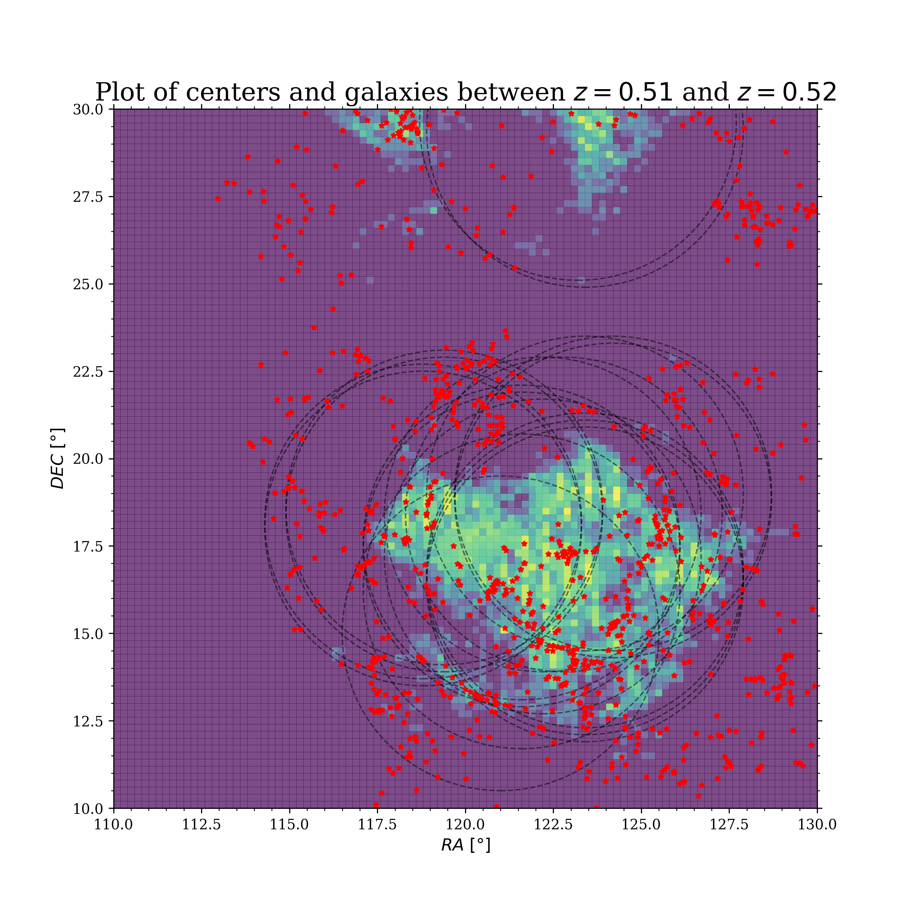
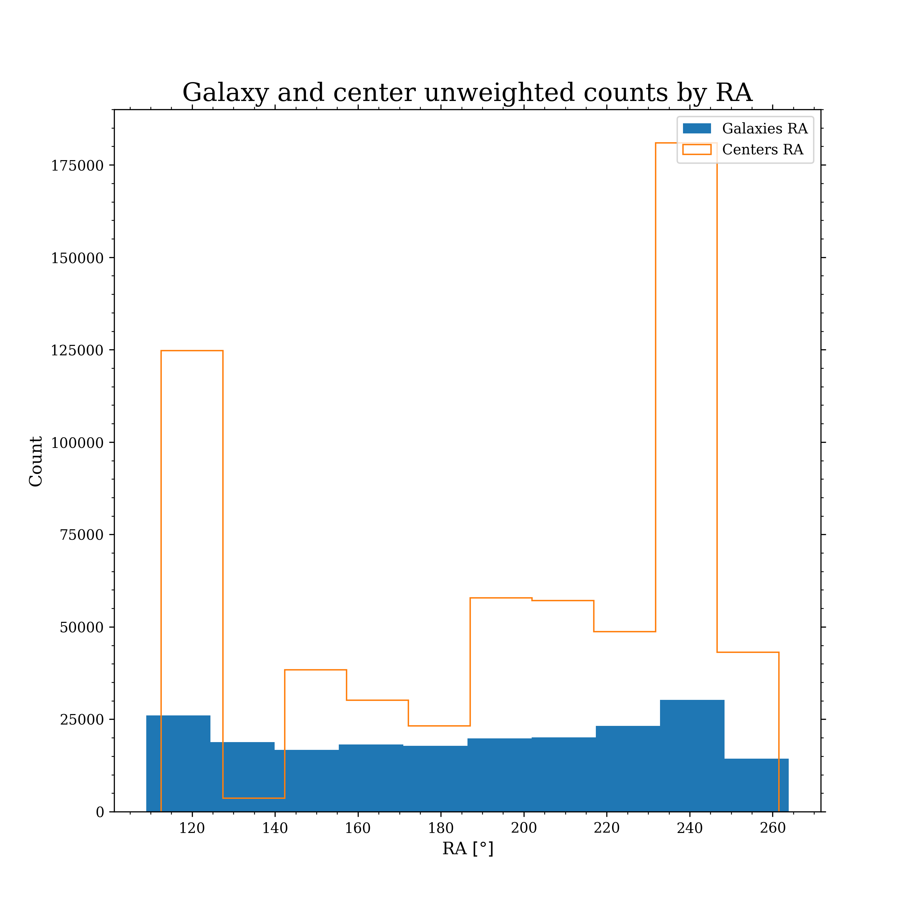

# CenterFinder

Please read the publication in [arXiv](https://arxiv.org/abs/2008.12793) before using this software.

## Contents
* [Setup](#setup)
* [I/O](#io)
* [Run](#run)
* [Options](#options)
    * [Kernel](#kernel)
    * [Miscellaneous](#miscellaneous)
* [Plotting](#plotting)


## Setup
CenterFinder is written purely in Python 3. Please make sure to have it installed in your system before proceeding with the rest of these instructions. This readme assumes that the `python` keyword has been aliased to `python3`. This readme contains code that's meant for Unix-based terminals (Mac, Linux...). Windows analogues may be *slightly* different. 

Clone this repository by running the following in the terminal:
```
git clone https://github.com/mishtak00/centerfinder
```

*Optional, __recommended__:* Create and activate a virtual environment to host CenterFinder by running the following from the terminal while inside the centerfinder directory:
```
python -m venv cf_env
source cf_env/bin/activate
```

You can choose any package manager for python to install CenterFinder's requirements in the virtual environment (or directly to your system, if you didn't follow the *optional recommendation* above). I have chosen pip here as an example:
```
pip install -r requirements.txt
```

If you are running CenterFinder in a virtual environment, don't forget to deactivate the environment once the job has finished:
```
deactivate
```


## I/O
CenterFinder expects its input data in Astropy's FITS format (python recarrays). It reads in a 3 or 4-column [TableHDU](https://docs.astropy.org/en/stable/io/fits/api/tables.html#) depending on whether the input has a 4th column whose values are to serve as weights. The principal output of CenterFinder is a 4-column .fits table that contains location and weight information on each found baryon acoustic oscillation center. Each row is a 4-tuple of the right ascension, declination, redshift and weight of a center.

CenterFinder's main routine accepts weighted or unweighted input and deals with both cases accordingly. Run CenterFinder on weighted input through the -w or --weighted_input argument. In this case, the program expects a 4-column table. Otherwise, feed CenterFinder a 3-column input, omit the -w argument and it will treat each input data point read as having unit weight. The user can also feed a weighted catalog (4-column) to CenterFinder and omit -w to ignore the weights from the catalog and treat each data point as unit-weighted. A 3-column BinTableHDU containing CMASS DR9 mock data has been provided here as a test case.

Additionally, the program expects a JSON file named 'params.json'. The 'params_cmassdr9.json' file has been given here as a template parameters file. This file is expected to contain select cosmological parameters as well as a crucial class variable for CenterFinder: grid_spacing. Grid spacing is the side length of each cubic cell in the big grids that represent histograms in real space in CenterFinder. The latter is suggested to be kept between 5 and 10 h-1Mpc during testing stages, selecting values under 5 only when more refined analysis is needed. CenterFinder's runtime is inversely proportional to the fifth power of this variable, i.e. O(N^5) where N is the number of grid cells on each dimensional axis.

**Note**: The only cosmological parameters that the user is required to manually set in 'params.json' are Omega_M and Omega_K. One can set Omega_Lambda as well, but if omitted, it will be automatically calculated as 1 - Omega_M - Omega_K.


## Run
The following portion contains commands for running CenterFinder under different contexts.

#### Unweighted Input
To run the voting procedure on unweighted input, simply call the --kernel_radius or -r argument followed by the desired test radius in h-1Mpc.
```
python cfdriver.py mock_cmassDR9_north_3001.fits -r 110
```

#### Weighted Input
To run the voting procedure on weighted input, call the -w argument with the -r argument followed by the desired test radius.
```
python cfdriver.py mock_cmassDR9_north_3001.fits -w -r 110
```

#### Density Contrast
To subtract the expected grid from the galaxy density grid, call the --density_contrast or -c argument like below. This is the method described in *"2.2 The Density Field"* portion of the paper.

The default voting procedure won't apply background subtraction unless the user requests it. Call this argument without any trailing additions to keep all weights in the density field as they are:
```
python cfdriver.py mock_cmassDR9_north_3001.fits -r 110 -t 50 -c
```

Call it with an additional 0 to set all negative valued weights in the density field to 0. **Note:** This is the method used in the original study.
```
python cfdriver.py mock_cmassDR9_north_3001.fits -r 110 -t 250 -c 0
```

#### Over-Density
To subtract the average weighted density from the galaxy density grid, call the --overdensity or -o argument like below. The default voting procedure won't apply the overdensity correction unless the user requests it. **Note:** The -c and -o arguments are mutually exclusive. Only density contrast or over-density can be used at a time to generate the density field, not both.
```
python cfdriver.py mock_cmassDR9_north_3001.fits -r 110 -o
```


## Options
The following portion contains optional arguments that may be needed or wanted when running CenterFinder.

### Kernel
These options dictate the behavior of the kernel. You can think of the kernel as a sphericized 1-dimensional function, a shell, and you can choose what function to fit within the kernel box with the arguments below. The step, gaussian and wavelet functions will be centered at the kernel radius that's already been specified with the -r argument. These are all normalized in 1D.

Ommitting these kernel options altogether just reproduces the default behavior from the paper, i.e. CenterFinder runs with a step function kernel with the specified grid_spacing thickness.

#### Step function
Add the following argument to ask CenterFinder to construct a step-function kernel with a specific thickness in Mpc/h. The following just asks for a step function kernel with a thickness of 10Mpc/h. Omit the numerical argument and the step kernel will be constructed with a width of 1 grid_spacing.
```
--step_kernel 10
```

#### Gaussian function
Add the following argument for a gaussian function with a stdev of 20Mpc/h. You always have to specify the numerical argument here.
```
--gaussian_kernel 20
```

#### Wavelet function
Add the following argument for a wavelet with a width of 30Mpc/h. You always have to specify the numerical argument here.
```
--wavelet_kernel 30
```

#### Custom function
Define a custom function over a desired range by creating an .npy array of values in the centerfinder directory. This can be done in many ways with numpy. For example, if we want a very uninteresting 0 function, we can open the python interpreter from the terminal while in the centerfinder dir and type
```
python
>>> import numpy
>>> numpy.save("custom.npy", np.zeros(23))
>>> quit()
```
Now we have a custom function that's 23 indices long. This domain length is interpreted as 23\*grid_spacing by CenterFinder. Beware that np arrays are created from 0, so if you want something defined out to and including 110Mpc/h and your grid spacing is 5Mpc/h, you must feed CenterFinder an array that's 23 indices long.
Now that we have the custom function, we can specify it as the kernel function by adding the following argument to the usual centerfinder call, where the second string is the name of the .npy file containing our 1D function.
```
--custom_kernel custom.npy
```

#### Plot the kernel function
Add the following argument to have CenterFinder create and show a plot of the requested kernel function.
```
--show_kernel
```


### Miscellaneous

#### Exclude centers under a vote threshold
To apply a vote cut to the centers grid, call the --vote_threshold or -t argument followed by desired vote number. The default threshold is 0 (no cutting by vote number, every bin in the centers grid is preserved). **Note:** An original, uncut centers grid will be saved to the outputs folder if the user specifies the -s argument (see below).
```
python cfdriver.py mock_cmassDR9_north_3001.fits -r 110 -c 0 -t 250
```

#### Change the default hyperparameters file
Add the --params_file or -p argument to change the default file from which the cosmological parameters are loaded to a new file whose name is given as argument:
```
python cfdriver.py mock_cmassDR9_north_3001.fits -r 110 -c 0 -t 250 -p params_cmassdr9.json
```

#### Save additional output
Add the --save or -s argument to save additional outputs in the "out_INPUT_FILENAME" folder (created automatically inside current directory). One such output is the whole centers grid without a vote cut.
```
python cfdriver.py mock_cmassDR9_north_3001.fits -r 110 -c 0 -t 250 -p params_cmassdr9.json -s
```

#### Activate runtime messages to standard output
Add the --verbose or -v argument to have sanity checks and feedback on the running process printed to standard output as the program runs:
```
python cfdriver.py mock_cmassDR9_north_3001.fits -r 110 -c 0 -t 250 -p params_cmassdr9.json -s -v
```

#### Running on a supercomputer
Applying the Density Contrast method to the provided catalog as described in the paper will run in around 20 minutes on a 2019 Intel i9 processor with 32GB of memory, so running CenterFinder on computational clusters for high performance computing is not a necessity. In any case, the bash script batch.sh is provided in this repository as a general guideline for running the program on a high performance computer.


## Plotting

### Slice plot



You are able to plot a view of the results of CenterFinder that helps visualize its output just like the picture in section 3.6 of the paper. This can be done by adding the --plot_slice or -l argument to your command to CenterFinder. The picture will be saved in 300dpi png format in the outputs folder. Currently, circles are drawn around histogram cells that are in the upper 20 percentile by center density. In spatial regions where this would draw more than 20 on-screen circles, this density floor rises automatically until there are only 20 on-screen circles or less in order to preserve a clean result.

#### Whole space
Just append the argument with nothing else to produce a plot of all centers found and galaxies in the space. This is not recommended because it will probably produce a messy result, but the option is there if needed.
```
python cfdriver.py mock_cmassDR9_north_3001.fits -r 110 -p params_cmassdr9.json -s -l
```

#### Redshift slice
Add 2 trailing numbers to bound the centers and galaxies that will show up in the image by their redshift coordinate. The 1st will be read as the floor and 2nd will be read as the ceiling for the readshift values. This is a great image to start with and then zoom in by binding RA and DEC as well, shown in the third portion of this section.
```
-l 0.51 0.52
```

#### All bound
Add 6 trailing numbers to bind the centers and galaxies in the image by all their sky coordinates. The 1st, 2nd and 3rd pairs of numbers will be read as the redshift, right ascension and declination intervals, respectively. 
```
-l 0.51 0.52 110 130 10 30
```

### Coordinate histogram



Use this option if you want to look at the general distribution of a coordinate for both the input and the output data. Enter the argument below, indicating which coordinate you're interested in (RA, DEC, Z, R), and CenterFinder will plot a histogram of that coordinate for galaxies and centers alike. These distributions should be expected to be more or less overlapping with each other.
```
--plot_coord_hist RA
```


